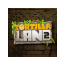
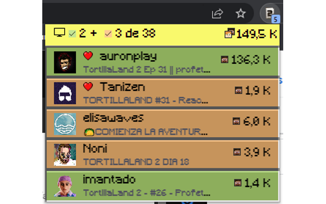

# Chrome Web Store

## Ficha de Play Store
### Detalles del producto
* **Descripción**: Ver *descripción* en [común](../common/common.md).
* **Categoría**: Ver *categoría* en [común](../common/common.md).

### Recursos gráficos
* **Icono de Chrome Web Store**: Basado en el [logo base](/assets/images/logos/logo128.png) con 16px de margen.

    
* **Capturas de pantalla localizadas**:

    

### Campos adicionales

* **URL de la página principal**: Ver *URL de la página principal* en [común](../common/common.md).
* **URL de asistencia**: Ver *URL de asistencia* en [común](../common/common.md).
## Prácticas de privacidad

### Una sola finalidad

* **Descripción del propósito único**: Mostrar que canales (con información extra) están retransmitiendo TortillaLand 2 para su fácil acceso.

### Justificación de permiso

* **Justificación de storage**: Guardar el token, ámbitos y como caché de la api de Twitch.
* **Justifición de alarms**: Recargar los canales cada minuto y validar el token de Twitch cada hora.
* **Justificación de identity**: Conectar con Twitch para obtener las retransmisiones y canales suscritos/seguidos.