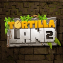
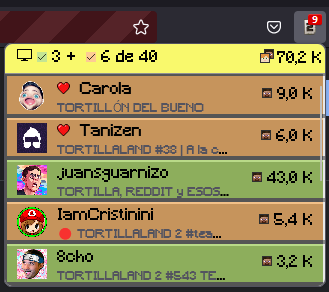

# Mozilla Addons

## Describir complemento

* **Descripción (básica)**: `description` de los metadatos.
* **Descripción (extendida)**: Ver *categoría* en [común](../common/common.md). *TortillaLand 2* en negrita y *Twitch* en cursiva.
* **Categorías**: Ver *categoría* en [común](../common/common.md).
* **Correo electrónico**: luskaner@gmail.com.
* **Página web**: Ver *URL de la página principal* en [común](../common/common.md).

## Imágenes

* **Icono del complemento**: Imagen de assets en tamaño 128x128. 

  

* **Capturas de pantalla**: 

  

## Más detalles

* **Etiquetas**: streaming, twitch.

## Detalles técnicos

* **Comentarios del desarrollador**: Envía cualquier problema o mejora en [Ver *URL de asistencia* en [común](../common/common.md)].

## Licencia

* **Tipo**: Otro.
* **Nombre de licencia**: Ver *Tipo de Licencia* en [común](../common/common.md) 
* **Texto de licencia**: Ver *Texto de Licencia* en [común](../common/common.md)
