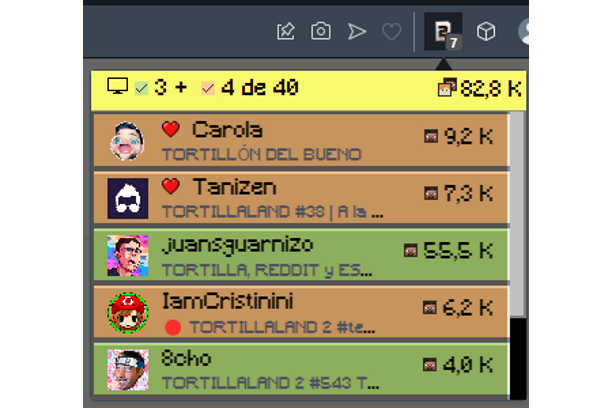

# Opera addons

## General

* **Category**: Ver *categoría* en [común](../common/common.md).

## Versions

### General

#### Info

* **Extension support page URL**: Ver *URL de asistencia* en [común](../common/common.md).
* **Extension source code URL (public)**: [https://github.com/luskaner/companero-tortillaland-2](https://github.com/luskaner/companero-tortillaland-2) agregando *tag*.
* **Build instructions**: *Texto de [README.md](README.md)*.

### Translations

* **Description**: Ver *descripción* en [común](../common/common.md).

### Media

* **Screenshots**:

    
* **Icon**: Basado en el [logo base](/assets/images/logos/logo128.png) redimensionado a 64x64.

    